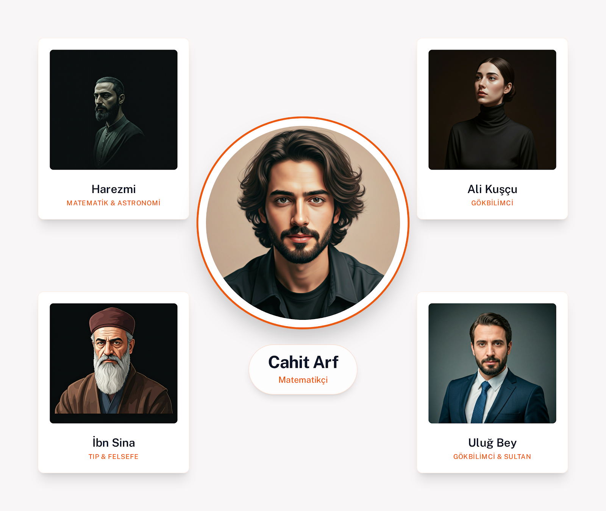
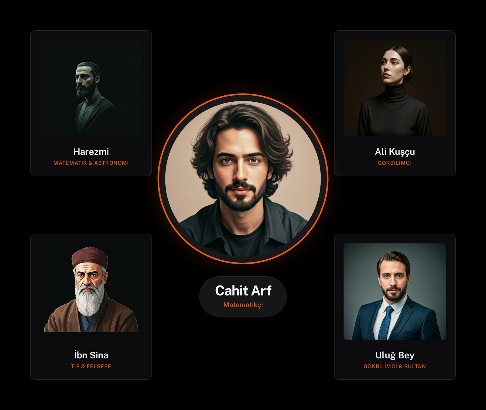
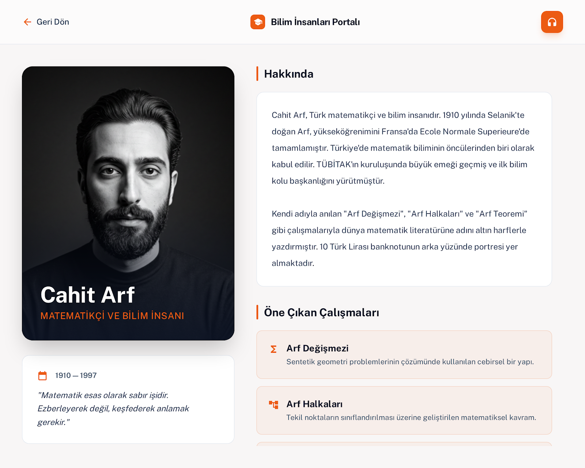
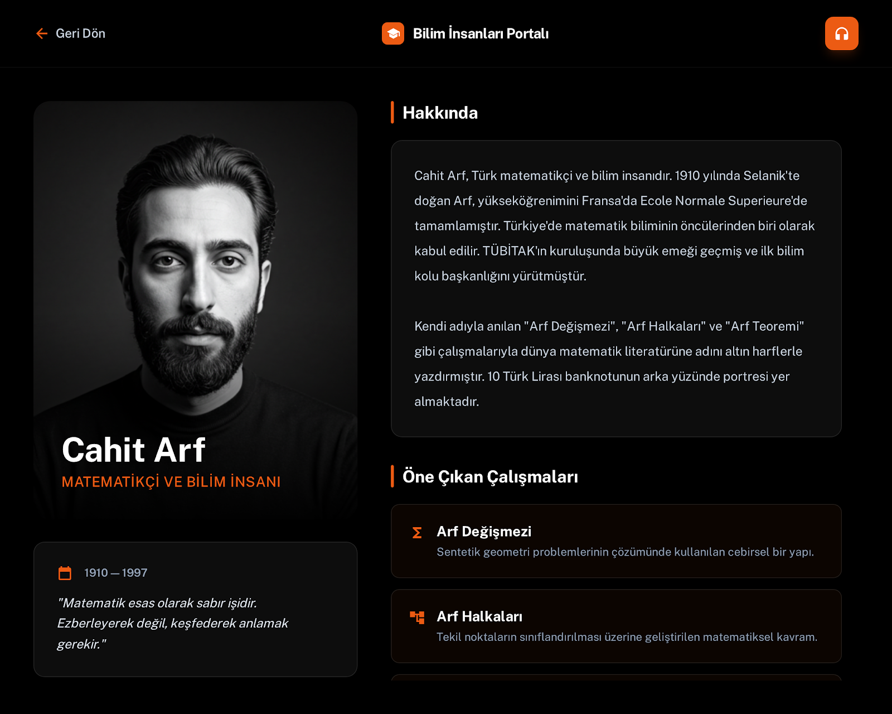
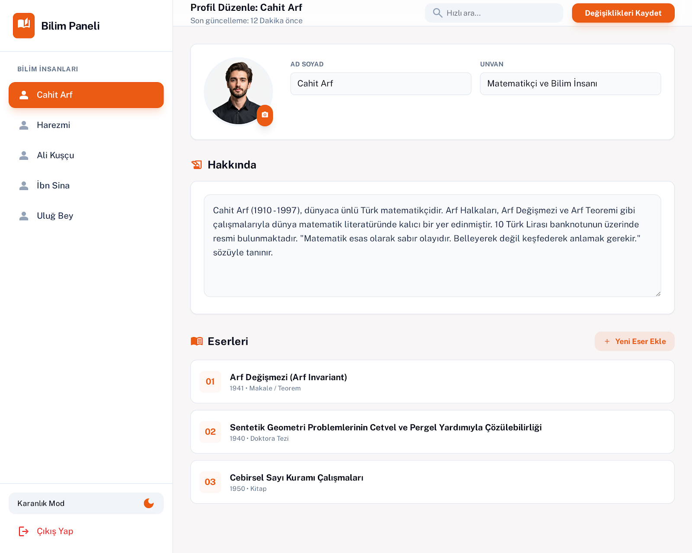
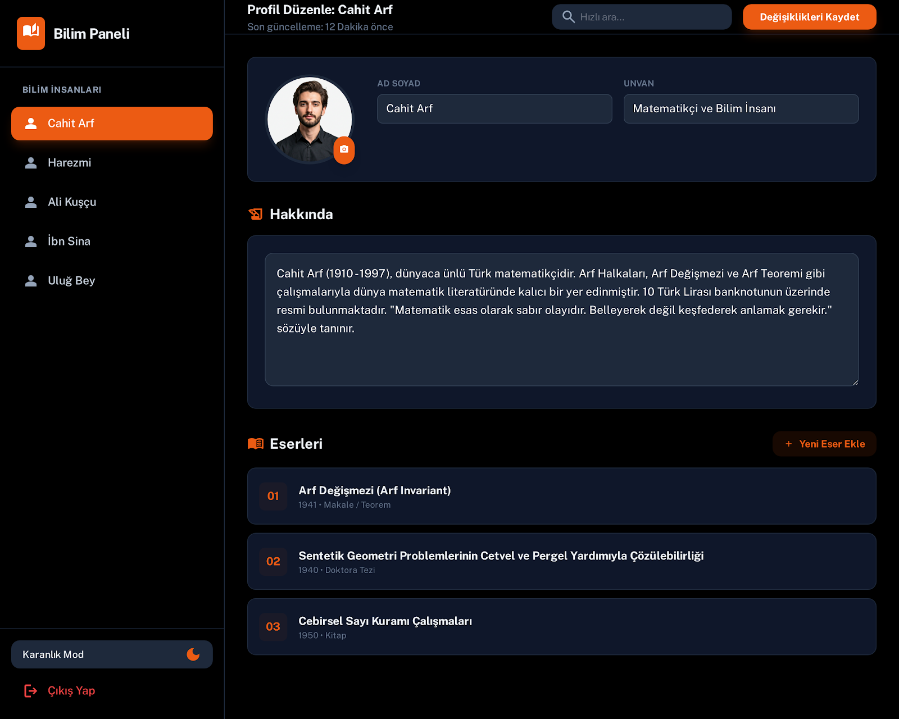

<div align="center">

# 🔭 Bilim İnsanları

**İslam dünyasının yetiştirdiği büyük bilim insanlarını keşfet.**

[](https://flutter.dev)
[](https://dart.dev)
[](LICENSE)
[](https://flutter.dev)
[](https://developer.android.com)

</div>

---

## 📖 Proje Hakkında

**Bilim İnsanları**, Flutter ile geliştirilmiş tamamen **responsive** bir mobil eğitim uygulamasıdır. Harezmi, Ali Kuşçu, İbn-i Sina, Uluğ Bey ve Cahit Arf gibi İslam dünyasının öncü isimlerini; fotoğraf, detaylı biyografi, eserleri ve **sesli anlatım** ile tanıtır.

Uygulama; telefon, küçük/orta/büyük tablet ekranlarında otomatik olarak uyum sağlar ve Material 3 uyumlu **açık/koyu tema** desteği sunar.

---

## ✨ Özellikler

| # | Özellik | Açıklama |
|---|---------|----------|
| 1 | 📱 Responsive Tasarım | Telefon, küçük/orta/büyük tablet için otomatik layout |
| 2 | 🌙 Açık / Koyu Tema | Material 3 uyumlu, anlık tema değişimi |
| 3 | 🔊 Sesli Anlatım | Her bilim insanı için ayrı ses dosyası, otomatik oynatma |
| 4 | 🎨 Tematik Arka Plan | Her bilim insanına özgü dekoratif CustomPaint görseller |
| 5 | 🔍 Görünüm Ölçeği | Otomatik / Küçük / Orta / Büyük ölçek seçeneği |
| 6 | ✏️ İçerik Yönetimi | Fotoğraf, ses, biyografi ve eserler yönetici panelinden düzenlenebilir |
| 7 | 🔐 Güvenli Ayarlar | Parola korumalı yönetici paneli |
| 8 | 💾 Kalıcı Saklama | Veriler ve tercihler SharedPreferences + SQLite ile cihazda saklanır |
| 9 | 🚀 Onboarding Ekranı | İlk açılışta animasyonlu karşılama ekranı |

---

## 🧑‍🔬 Bilim İnsanları

| İsim | Alan | Dönem |
|------|------|-------|
| **Harezmi** | Matematik & Algoritma | 780 – 850 |
| **Ali Kuşçu** | Astronomi | 1403 – 1474 |
| **İbn-i Sina** | Tıp & Felsefe | 980 – 1037 |
| **Uluğ Bey** | Astronomi & Matematik | 1394 – 1449 |
| **Cahit Arf** | Matematik | 1910 – 1997 |

---

## 📐 Responsive Breakpoint Sistemi

| Ekran Tipi | Genişlik | Kart Düzeni |
|------------|----------|-------------|
| 📱 Telefon | ≤ 599 dp | 2 sütun, 3 satır |
| 📟 Küçük Tablet | 600 – 839 dp | 3 sütun, 2 satır |
| 🖥️ Orta Tablet | 840 – 1199 dp | 5 kart tek satır |
| 🖥️ Büyük Tablet | ≥ 1200 dp | 5 kart tek satır (geniş) |

- **Telefon detay sayfası:** Dikey (tek sütun) layout
- **Tablet detay sayfası:** İki kolonlu — sol: fotoğraf + isim, sağ: biyografi + eserler + ses oynatıcı

---

## 🖼️ Ekran Görüntüleri

| Ana Sayfa (Light) | Ana Sayfa (Dark) | Detay (Light) | Detay (Dark) |
|:-----------------:|:----------------:|:-------------:|:------------:|
|  |  |  |  |

| Ayarlar (Light) | Ayarlar (Dark) |
|:---------------:|:--------------:|
|  |  |

---

## 🗂️ Proje Yapısı

```
lib/
├── main.dart                      # Uygulama giriş noktası
├── models/
│   └── scientist.dart             # Bilim insanı veri modeli
├── providers/
│   └── app_state.dart             # Global state yönetimi (Provider)
├── screens/
│   ├── home_screen.dart           # Ana ekran – kart grid
│   ├── detail_screen.dart         # Detay & ses oynatıcı
│   ├── settings_screen.dart       # Ayarlar & yönetim paneli
│   ├── login_screen.dart          # Parola girişi
│   └── onboarding_screen.dart     # İlk açılış ekranı
├── services/
│   ├── audio_service.dart         # Ses oynatma (just_audio)
│   ├── auth_service.dart          # Parola & oturum yönetimi (sqflite)
│   └── storage_service.dart       # Veri saklama (SharedPreferences)
├── utils/
│   ├── app_theme.dart             # Material 3 tema (light/dark)
│   └── responsive_helper.dart     # Breakpoint & ölçek hesaplama
└── widgets/
    └── scientist_background.dart  # Tematik CustomPaint arka planlar
```

---

## 📦 Kullanılan Teknolojiler

| Paket | Versiyon | Amaç |
|-------|----------|------|
| `flutter` + `dart` | 3.x | Framework & dil |
| `provider` | ^6.1.5 | State management |
| `shared_preferences` | ^2.5.4 | Tercih kalıcılığı |
| `sqflite` + `path` | ^2.4.2 | SQLite veritabanı |
| `just_audio` | ^0.10.5 | Ses oynatma |
| `audio_session` | ^0.2.2 | Ses oturumu yönetimi |
| `google_fonts` | ^8.0.2 | Özel yazı tipi (Public Sans) |
| `image_picker` | ^1.2.1 | Fotoğraf seçme |
| `image_cropper` | ^11.0.0 | Fotoğraf kırpma |
| `file_picker` | ^10.3.10 | Dosya seçme (ses) |
| `path_provider` | — | Dosya sistemi yolları |

---

## 🚀 Kurulum & Çalıştırma

**Gereksinimler:** Flutter SDK 3.x, Dart 3.x, Android Studio veya VS Code

```bash
# 1. Repoyu klonla
git clone https://github.com/ycagdass/Islamic-Explorers-science-app.git
cd Islamic-Explorers-science-app

# 2. Bağımlılıkları yükle
flutter pub get

# 3. Uygulamayı çalıştır
flutter run

# 4. Release APK derle
flutter build apk --release
```

> **Derlenen APK:** `build/app/outputs/flutter-apk/app-release.apk` (~52.9 MB)

---

## 🔒 Güvenlik & Gizlilik

- Ayarlar paneline **parola koruması** uygulanmıştır.
- `SafeArea` kullanılarak sistem çubuğu çakışmaları önlenmiştir.
- Tüm kullanıcı verileri **yalnızca cihaz üzerinde** saklanır; hiçbir veri dışarıya gönderilmez.
- Google Fonts çevrimdışı modda çalışır (`allowRuntimeFetching: false`).

---

## 🛠️ Geliştirme Notları

- `flutter analyze` → ✅ Hata yok
- `flutter build apk --release` → ✅ Başarılı
- **Minimum SDK:** Android API 21+ (Android 5.0 Lollipop)
- **Tüm yönlendirmeler aktif:** Portre + Yatay (telefon & tablet)
- **Edge-to-edge** ekran desteği: Şeffaf sistem çubukları

---

## 📄 Lisans

Bu proje [MIT Lisansı](LICENSE) ile lisanslanmıştır.

---

<div align="center">

*Uygulama eğitim amaçlı geliştirilmiştir.*

**⭐ Beğendiyseniz yıldız vermeyi unutmayın!**

</div>

